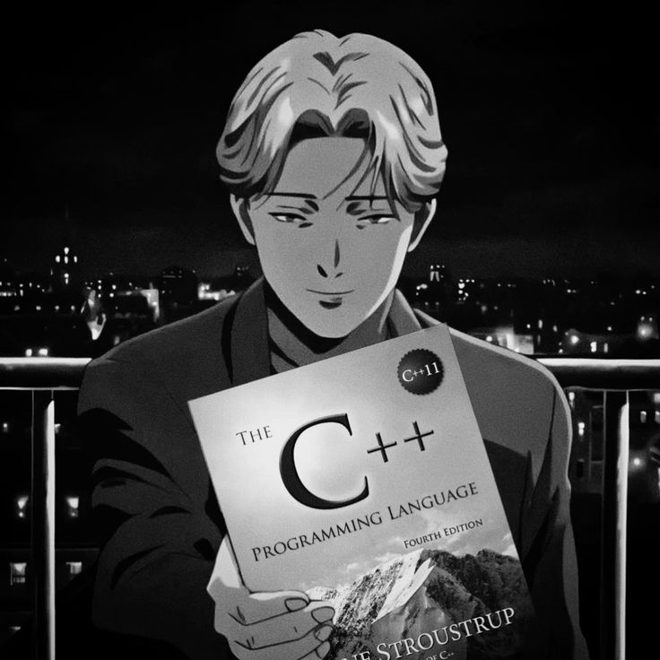
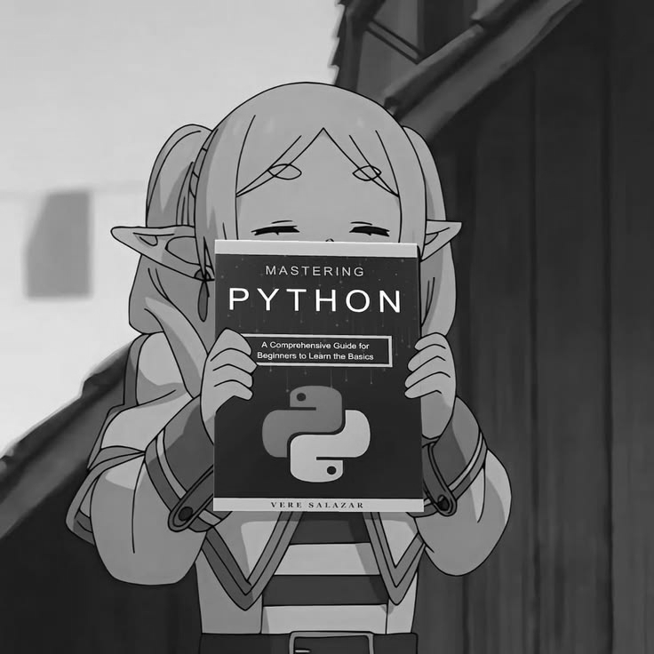

  

<h1 align="center">Hi 👋 I'm Sahil Mahure</h1>

<h3 align="center">
Full Stack Developer | React | Next.js | Three.js
</h3>

---

## 🚀 About Me

- 🎓 B.Tech Student at Symbiosis Institute of Technology
- 💻 Passionate about Full Stack Development
- 🎮 Love creating cinematic & 3D websites
- 🌱 Currently learning Three.js and AI

  
## ⚔ Current Arsenal

<table align="center">
<tr>

<td align="center">
 
<b>C++</b> 
<i>Building strong fundamentals.</i>
</td>

<td align="center">
 
<b>Python</b> 
<i>Automation & AI.</i>
</td>

</tr>
</table>

  

  <em>
    "I can fix the world, 
    but they won't give me the source code."
  </em>

  

