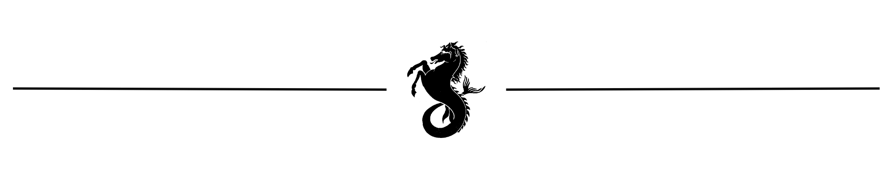

  

<h1 align="center">
  Hi 👋 I'm Sahil Mahure
</h1>

  <b>Full Stack Developer</b> • React • Next.js • Three.js

  <i>
    Building digital experiences that people remember.
  </i>

---

## 🚀 About Me

- 🎓 B.Tech Student at Symbiosis Institute of Technology
- 💻 Passionate about Full Stack Development
- 🎮 Love creating cinematic & 3D websites
- 🌱 Currently learning Three.js and AI

  
## ⚔ Current Arsenal

<table align="center">
<tr>

<td align="center">
 
<b>C++</b> 
<i>Building strong fundamentals.</i>
</td>

<td align="center">
 
<b>Python</b> 
<i>Automation & AI.</i>
</td>

</tr>
</table>

---

  

 

<h3 align="center">
<i>"I can fix the world, 
but they won't give me the source code."</i>
</h3> 

  

---

  

  <h2 align="center">📡 Connect With Me</h2>

  

  

  

 

Thanks for stopping by ⭐

